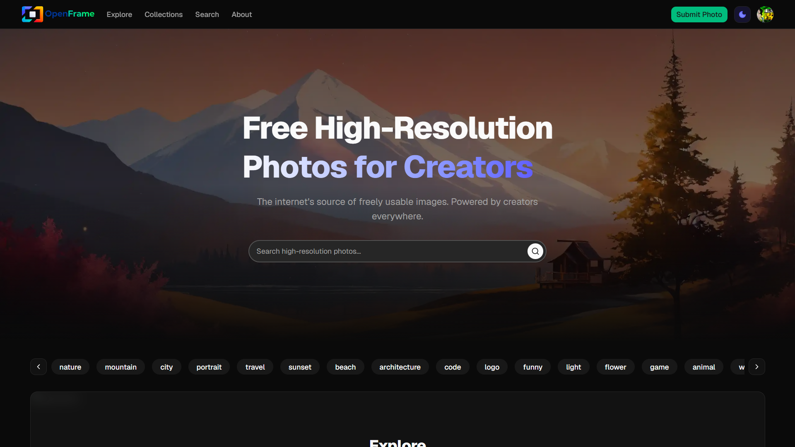

<p align="center">
  
</p>

<p align="center">

**An Unsplash-style image-sharing platform featuring event-driven processing via Kafka, direct-to-S3 uploads, BlurHash previews, NSFW detection and dominant color extraction - built as a full-stack monorepo**

</p>

<p align="center">
  <a href="https://nextjs.org/"></a>
  <a href="https://zustand-demo.pmnd.rs/"></a>
  <a href="https://mdxjs.com/"></a>
  <a href="https://tailwindcss.com/"></a>
  <a href="https://nodejs.org/"></a>
  <a href="https://expressjs.com/"></a>
  <a href="https://jwt.io/"></a>
  <a href="https://www.postgresql.org/"></a>
  <a href="https://www.prisma.io/"></a>
  <a href="https://redis.io/"></a>
  <a href="https://kafka.apache.org/"></a>
  <a href="https://turbo.build/"></a>
  <a href="https://upstash.com/"></a>
  <a href="https://aws.amazon.com/s3/"></a>
</p>

---

<p align="center">
  
</p>

<p align="center">
  <a href="https://open-frame.sayantan.online">
    <strong>🚀 Try it Live</strong>
  </a>
</p>

## What Makes It Interesting

### Image Processing

- EXIF metadata extraction
- BlurHash generation for fast image previews
- Dominant color and palette extraction
- NSFW content detection
- Image optimization and processing pipeline

### User Experience

- User authentication and customizable profiles
- Advanced search across photos, tags, and creators
- Curated collections and creator profiles
- High-performance image upload and delivery
- Direct-to-S3 uploads using presigned URLs

### Architecture & Scalability

- Event-driven architecture powered by Kafka
- Asynchronous worker-based image processing
- Redis-backed caching layer
- Scalable PostgreSQL database with Prisma ORM
- Search functionality powered by Upstash Search
- Email queue processing
- Modular REST API built with Node.js and Express
- Optimized frontend built with Next.js
- Monorepo architecture with Turborepo

## Folder Structure

### Monorepo

The project is organized as a Turborepo monorepo with:

- Applications (`apps/*`)
- Shared packages (`packages/*`)

```text
apps/
  web/ # Frontend
  api/ # REST API
  worker-image-processor/ # Generates variants for an image
  worker-image-metadata/ # Extracts metadata,blurhash and colors from an image
  worker-image-finalize/ # Finalizes an image for DB write
  worker-db-write/ # Writes an image and engagement to DB
  worker-email-queue/ # Sends emails

packages/
  lib/ # shared utilities (Prisma, Redis, Kafka etc.)
  ui/ # shared UI components
  constants/ # shared constants
  types/ # shared types
  schema/ # shared schemas
```

## Database ER Diagram


## Architecture Overview

OpenFrame follows an event-driven architecture.

### Upload Strategy

Images are uploaded directly from the client to S3-compatible storage using presigned URLs.

Benefits:

- Reduced API bandwidth
- Better scalability
- Faster uploads
- Lower server load

### Upload Pipeline

1. Client requests a presigned upload URL from API
2. API generates and returns the URL
3. Client uploads directly to S3-compatible storage
4. Client notifies API about the uploaded image
5. API publishes a `picture-upload` event
6. Workers asynchronously:
   - Extract metadata
   - Generate blurhash
   - Extract dominant color and palette
   - Upload processed variants
   - Update database
   - Refresh cache

### Read Pipeline

1. Client requests image data
2. API checks Redis cache
3. Falls back to PostgreSQL if needed
4. Cache is refreshed automatically

### Caching

Redis is used for:

- Image metadata caching
- Frequently accessed picture data
- Engagement metrics caching
- Reducing PostgreSQL load

### Background Jobs

Kafka workers handle:

- Image processing
- Metadata extraction
- Database updates
- Engagement updates
- Email delivery

## Kafka Topics

> Kafka is used to decouple image processing, metadata extraction, database updates and email delivery through asynchronous events.

| Topic                          | Description                                                                        |
| ------------------------------ | ---------------------------------------------------------------------------------- |
| `picture-upload`               | Triggered when a new picture is uploaded. Starts the processing pipeline.          |
| `metadata-extraction-complete` | Published after metadata,blurhash and colors are extracted.                        |
| `processing-complete`          | Published after image variants have been generated.                                |
| `db-write`                     | Triggers database update operations for the processed image and engagement events. |
| `email-queue`                  | Queues an email notification to be sent to the user for various purposes.          |

## Architecture Diagram


## Prerequisites

- Node.js 20+
- pnpm
- PostgreSQL
- Kafka
- Redis
- S3 compatible storage
- Upstash Search keys _(for search functionality)_
- Google OAuth keys _(for google login)_
- SMTP server _(for password reset and verification emails)_

## Running the Project

### Free Services (Recommended)

_⚠️ No credit card required_

- **PostgreSQL:** Neon, Aiven PostgreSQL
- **Kafka:** Aiven Kafka
- **Redis:** Upstash Redis, Aiven Valkey
- **S3 Storage:** Tigris Data
- **Search:** Upstash Search
- **OAuth:** Google Cloud
- **SMTP:** Resend, Brevo

### 1. Setup Environment Variables

Rename `.env.example` to `.env` and update values.

### 2. Run the Application

```bash
# install dependencies
pnpm install

# setup everything (DB migration, Prisma client generation, DB seeding, Kafka topics creation)
pnpm db:generate
pnpm db:migrate
pnpm db:seed
pnpm kafka-topic-and-search-setup

# or

pnpm setup:all

# build all apps including packages
pnpm build

# start dev server
pnpm dev

# start production build
pnpm start
```

### 3. Access the Application

Once all services are running:

- Frontend: http://localhost:3000
- Backend: http://localhost:4000/api/health

## Scripts

```bash
pnpm dev        # run all apps in dev mode
pnpm build      # build all apps including packages
pnpm start      # start production build
pnpm db:generate # generate Prisma client
pnpm db:migrate # run DB migration
pnpm db:seed     # seed the database
pnpm kafka-topic-and-search-setup # setup Kafka topics and Search (requires Kafka and Search running)
pnpm setup:all # setup everything (DB migration, Prisma client generation, DB seeding, Kafka topics creation, Search setup)
```
