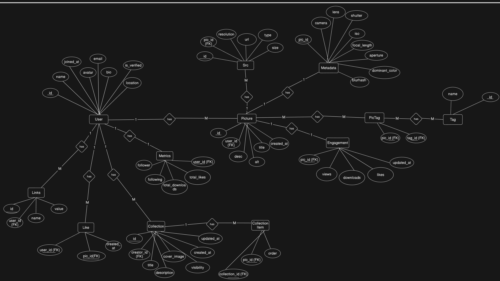
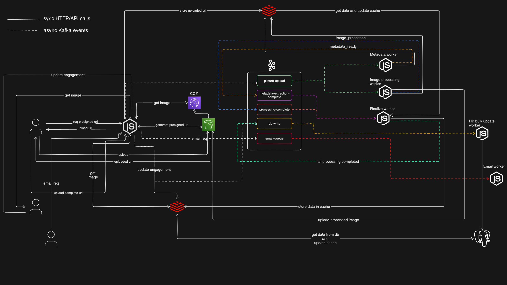

<p align="center">
  
</p>

<p align="center">

**An image-sharing platform built with a modern full-stack architecture.**

</p>

<p align="center">
  <a href="https://nextjs.org/"></a>
  <a href="https://mdxjs.com/"></a>
  <a href="https://tailwindcss.com/"></a>
  <a href="https://nodejs.org/"></a>
  <a href="https://expressjs.com/"></a>
  <a href="https://jwt.io/"></a>
  <a href="https://www.postgresql.org/"></a>
  <a href="https://www.prisma.io/"></a>
  <a href="https://redis.io/"></a>
  <a href="https://kafka.apache.org/"></a>
  <a href="https://turbo.build/"></a>
  <a href="https://upstash.com/"></a>
  <a href="https://aws.amazon.com/s3/"></a>
</p>

---

## Features

- High-performance image upload & delivery
- Kafka-powered background processing (resize, metadata, analytics)
- Scalable database with Prisma + PostgreSQL
- Secure authentication
- Monorepo architecture with Turborepo
- Modular API with Node.js + Express
- Optimized frontend with Next.js

## Folder Structure

```text
apps/
  web/ # Frontend
  api/ # REST API
  worker-image-processor/ # Kafka consumers (background job - image processing)
  worker-image-metadata/ # Kafka consumers (background job - image metadata extraction)
  worker-image-finalize/ # Kafka consumers (background job - image finalization for DB write)
  worker-image-db-write/ # Kafka consumers (background job - image db write)
  worker-engagement-db-write/ # Kafka consumers (background job - engagement db write)

packages/
  lib/ # shared utilities (Prisma, Redis etc.)
  ui/ # shared UI components
  constants/ # shared constants
  types/ # shared types
  schema/ # shared schemas

setup/ # setup scripts
```

## Database ER Diagram



## Kafka (Worker Flow)



- API or workers produce events (image uploads, metadata extraction completed, image processing completed, image engagement events etc.)
- Workers consume events asynchronously

Workers handles:

- Image processing
- Metadata extraction
- Image finalization
- Uploading images to S3 and updating the database
- Updating image engagement (views, likes, downloads)

## Prerequisites

- Node.js 20+
- pnpm
- PostgreSQL
- Kafka
- Redis
- S3 compatible storage
- Upstash Search keys _(for search functionality)_
- Google OAuth keys _(for google login)_
- SMTP server _(for password reset and verification badge emails)_

## Running the Project

### Free Services (Recommended)

_⚠️ No credit card required_

- **PostgreSQL:** Neon, Aiven PostgreSQL
- **Kafka:** Aiven Kafka
- **Redis:** Upstash Redis, Aiven Valkey
- **S3 Storage:** Tigris Data
- **Search:** Upstash Search
- **OAuth:** Google Cloud
- **SMTP:** Resend, Brevo

### 1. Setup Environment Variables

Rename `.env.example` to `.env` and update values.

### 2. Run the Application

```bash
# install dependencies
pnpm install

# setup everything (DB migration, Prisma client generation, DB seeding, Kafka topics creation)
pnpm setup

# build all apps including packages
pnpm build

# start dev server
pnpm dev

# start production build
pnpm start
```

### 3. Access the Application

Once all services are running:

- Frontend: http://localhost:3000
- Backend: http://localhost:4000/api/health

## Scripts

```bash
pnpm dev        # run all apps in dev mode
pnpm build      # build all apps including packages
pnpm start      # start production build
pnpm setup      # setup everything (DB migration, Prisma client generation, DB seeding, Kafka topics creation)
pnpm db:generate # generate Prisma client
pnpm db:migrate # run DB migration
pnpm db:seed     # seed the database
```
