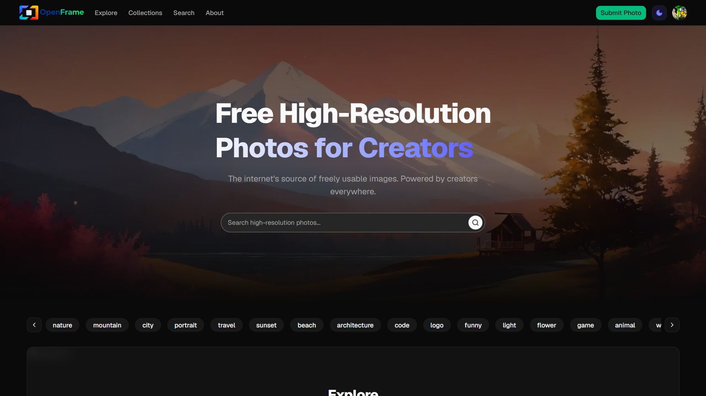
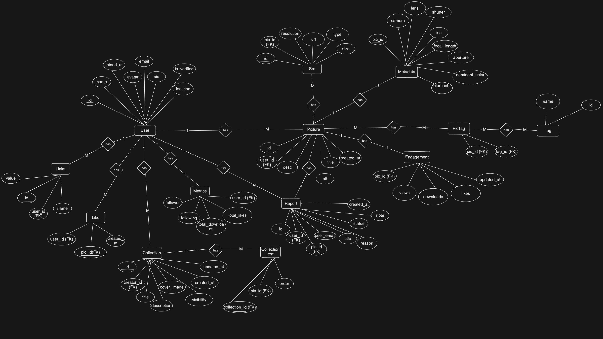
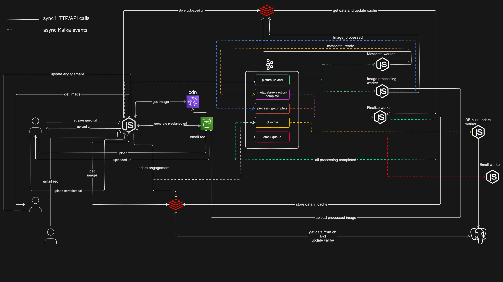

<p align="center">
  
</p>

<p align="center">

**An image-sharing platform with event-driven processing powered by Kafka, direct-to-S3 uploads, BlurHash previews, NSFW detection, dominant color extraction, AI image generation, image exploration, and a developer API - all built as a full-stack monorepo.**

</p>

<p align="center">
  <a href="https://nextjs.org/"></a>
  <a href="https://zustand-demo.pmnd.rs/"></a>
  <a href="https://tanstack.com/query"></a>
  <a href="https://mdxjs.com/"></a>
  <a href="https://tailwindcss.com/"></a>
  <a href="https://nodejs.org/"></a>
  <a href="https://expressjs.com/"></a>
  <a href="https://zod.dev/"></a>
  <a href="https://jwt.io/"></a>
  <a href="https://www.postgresql.org/"></a>
  <a href="https://www.prisma.io/"></a>
  <a href="https://redis.io/"></a>
  <a href="https://kafka.apache.org/"></a>
  <a href="https://sharp.pixelplumbing.com/"></a>
  <a href="https://turbo.build/"></a>
  <a href="https://upstash.com/"></a>
  <a href="https://aws.amazon.com/s3/"></a>
  <a href="https://aws.amazon.com/s3/"></a>
</p>

---

<p align="center">
  
</p>

<p align="center">
  <a href="https://openframe.page">
    <strong>🌐 Live Demo</strong>
  </a>
  &nbsp;&nbsp;•&nbsp;&nbsp;
  <a href="https://openframe.page/api">
    <strong>⚡ API Docs</strong>
  </a>
</p>

## What Makes It Interesting

### Image Processing & Intelligence

- AI Text-to-Image generation
- EXIF metadata extraction
- BlurHash generation for fast image previews
- Dominant color and palette extraction using Sharp & Node Vibrant
- NSFW content detection powered by NSFWJS
- Image optimization and processing pipeline

### User Experience

- User authentication and customizable profiles
- AI artwork & prompt-based image generation studio
- Advanced search across photos, tags, and creators
- Curated collections and creator profiles
- High-performance image upload and delivery
- Direct-to-S3 uploads using presigned URLs

### Developer API

- RESTful API built with Node.js and Express
- Interactive API reference documentation powered by Scalar
- API key-based authentication using `x-api-key`
- Per-key rate limiting
- Secure internal service authentication using HMAC-SHA256 tokens (`x-internal-token`)
- API endpoints for images, users, collections, search and metadata
- Designed for programmatic access and third-party integrations

### Architecture & Scalability

- Event-driven architecture powered by Kafka
- Asynchronous worker-based image processing
- Redis-backed caching layer
- Scalable PostgreSQL database with Prisma ORM
- Search functionality powered by Upstash Search
- Email queue processing
- Optimized frontend built with Next.js
- Monorepo architecture with Turborepo

## Folder Structure

### Monorepo

The project is organized as a Turborepo monorepo with:

- Applications (`apps/*`)
- Shared packages (`packages/*`)

```text
apps/
  web/ # Frontend
  api/ # REST API & Developer API Service
  worker-image-processor/ # Generates variants for an image
  worker-image-metadata/ # Extracts metadata,blurhash and colors from an image
  worker-image-finalize/ # Finalizes an image for DB write
  worker-db-write/ # Writes an image and engagement to DB
  worker-email-queue/ # Manages email delivery

packages/
  lib/ # shared utilities (Prisma, Redis, Kafka etc.)
  ui/ # shared UI components
  constants/ # shared constants
  types/ # shared types
  schema/ # shared schemas
```

## Database ER Diagram



## Architecture Overview

OpenFrame follows an event-driven architecture.

### Upload Strategy

Images are uploaded directly from the client to S3-compatible storage using presigned URLs.

Benefits:

- Reduced API bandwidth
- Better scalability
- Faster uploads
- Lower server load

### Upload Pipeline

1. Client requests a presigned upload URL from API
2. API generates and returns the URL
3. Client uploads directly to S3-compatible storage
4. Client notifies API about the uploaded image
5. API publishes a `picture-upload` event
6. Workers asynchronously:
   - Extract metadata
   - Generate blurhash
   - Extract dominant color and palette
   - Upload processed variants
   - Update database
   - Refresh cache

### Read Pipeline

1. Client requests image data
2. API checks Redis cache
3. Falls back to PostgreSQL if needed
4. Cache is refreshed automatically

### Caching

Redis is used for:

- Image metadata caching
- Frequently accessed picture data
- Engagement metrics caching
- Reducing PostgreSQL load

### Background Jobs

Kafka workers handle:

- Image processing
- Metadata extraction
- Database updates
- Engagement updates
- Email delivery

## Kafka Topics

> Kafka is used to decouple image processing, metadata extraction, database updates and email delivery through asynchronous events.

| Topic                          | Description                                                                        |
| ------------------------------ | ---------------------------------------------------------------------------------- |
| `picture-upload`               | Triggered when a new picture is uploaded. Starts the processing pipeline.          |
| `metadata-extraction-complete` | Published after metadata,blurhash and colors are extracted.                        |
| `processing-complete`          | Published after image variants have been generated.                                |
| `db-write`                     | Triggers database update operations for the processed image and engagement events. |
| `email-queue`                  | Queues an email notification to be sent to the user for various purposes.          |

## Architecture Diagram



## Developer API & Authentication

OpenFrame includes a public Developer API for third-party integrations alongside secure internal token-based authentication for the web application.

### 1. Developer API Key Authentication (`x-api-key`)

External developers can make `GET` requests to public endpoints using an API key header.

- **Header:** `x-api-key: <your_api_key>`
- **Rate Limit:** 100 requests per minute per API key.
- **Allowed Methods:** `GET` requests only.

#### API Key Management Endpoints (`/keys`)

Authenticated users can create and manage their developer API keys:

- `POST /keys` — Generate a new API key _(Rate limit: 20 req/min)_
- `GET /keys` — List active API keys for the user _(Rate limit: 20 req/min)_
- `PATCH /keys/:id` — Revoke/disable an API key _(Rate limit: 20 req/min)_

### 2. Internal Token Authentication (`x-internal-token`)

For web application requests, short-lived HMAC-SHA256 signed internal tokens are generated via `/internal-token` and validated by the backend middleware using `INTERNAL_SECRET`.

- **Header:** `x-internal-token: <timestamp>.<signature>`

### Public API Endpoints (`GET`)

| Endpoint                          | Description                                                     | Auth Required                    |
| --------------------------------- | --------------------------------------------------------------- | -------------------------------- |
| `GET /picture/explore`            | Fetch explore pictures with search, tag, and pagination support | `x-api-key` / `x-internal-token` |
| `GET /picture/tags`               | List popular picture tags                                       | `x-api-key` / `x-internal-token` |
| `GET /picture/:id`                | Retrieve picture details by ID                                  | `x-api-key` / `x-internal-token` |
| `GET /picture/user/:id`           | List pictures uploaded by a user                                | `x-api-key` / `x-internal-token` |
| `GET /picture/user/liked/:userId` | List pictures liked by a user                                   | `x-api-key` / `x-internal-token` |
| `GET /collection`                 | Browse public collections                                       | `x-api-key` / `x-internal-token` |
| `GET /collection/:id`             | Retrieve collection details and photo items                     | `x-api-key` / `x-internal-token` |
| `GET /collection/user/:userId`    | List collections created by a user                              | `x-api-key` / `x-internal-token` |
| `GET /user/:id`                   | Get public user profile                                         | `x-api-key` / `x-internal-token` |
| `GET /search?q=:query&type=:type` | Search across photos, users, and collections                    | `x-api-key` / `x-internal-token` |

## Prerequisites

- Node.js 20+
- pnpm
- PostgreSQL
- Kafka
- Redis
- S3 compatible storage
- Upstash Search keys _(for search functionality)_
- Cloudflare Workers AI endpoint _(for AI image genaration)_
- Google OAuth keys _(for google login)_
- SMTP server _(for password reset and verification emails)_

## Running the Project

### Free Services (Recommended)

_⚠️ No credit card required_

- **PostgreSQL:** Neon, Aiven PostgreSQL
- **Kafka:** Aiven Kafka
- **Redis:** Upstash Redis, Aiven Valkey
- **S3 Storage:** Tigris Data
- **Search:** Upstash Search
- **OAuth:** Google Cloud
- **SMTP:** Resend, Brevo

### 1. Setup Environment Variables

Rename `.env.example` to `.env` and update configuration values (including database URLs, Redis instances, Kafka broker/certificates, S3 credentials, Google OAuth keys, `INTERNAL_SECRET`, `JWT_ACCESS_SECRET`, `JWT_REFRESH_SECRET`, `ALLOWED_ORIGINS`, and search keys).

### 2. Run the Application

```bash
# install dependencies
pnpm install

# setup everything (DB migration, Prisma client generation, DB seeding, Kafka topics creation)
pnpm db:generate
pnpm db:migrate
pnpm db:seed
pnpm kafka-topic-and-search-setup

# or

pnpm setup:all

# build all apps including packages
pnpm build

# start dev server
pnpm dev

# start production build
pnpm start
```

### 3. Access the Application

Once all services are running:

- Frontend: http://localhost:3000
- Backend Health Check: http://localhost:4000/health
- Developer API Base URL: http://localhost:4000

## Enable AI image generation ( optional )

### 1. Get a Cloudflare Account

- Sign up at [Cloudflare](https://dash.cloudflare.com/sign-up) if you don't have one

### 2. Create a New Worker

- Go to the [Home](https://dash.cloudflare.com)
- On the left sidebar, click on [Compute] and then [Workers & Pages]
- Click **"Create application"**
- Choose **"Start with Hello World!"**
- Give it a name like `text-to-image-api`
- Click **"Deploy"** to create a Hello World worker

### 3. Replace the Worker Code

- On the top right click on **"Edit Code"** button
- In the worker editor, replace the default Hello World code with the [worker.js](./docs/images/worker.js) code
- Click **"Save and Deploy"**

### 4. Set Up Environment Variables

- In your worker dashboard, go to **"Settings"** > **"Runtime variables and secrets"**
- Under **"Environment Variables"**, click **"Add variable"**
- Name: `API_KEY`
- Value: `your-secret-api-key` (replace with a strong secret key)

### 5. Enable Workers AI

- In the Cloudflare dashboard, go to **"Workers & Pages"** > **"AI"**
- Enable Workers AI for your account

### 6. Add AI Binding to Your Worker

- Go back to your worker's dashboard
- Click on **"binding"**
- Select **"Workers AI"**
- Click **"Add binding"**
- Variable Name: `AI`
- Click **"Add binding"**

> **Important:** Without this AI binding, your worker won't be able to access Cloudflare's AI models!

### 7. Get Your Worker URL

- Your worker will be available at: `https://<your-worker-name>.<your-subdomain>.workers.dev`
- You can find the exact URL in your worker's dashboard

### 8. Save it to .env file

```bash
IMAGE_GEN_URL="https://<your-worker-name>.<your-subdomain>.workers.dev/v1/images/generations"
IMAGE_GEN_API_KEY="<your-secret-api-key>"
```

## Scripts

```bash
pnpm dev        # run all apps in dev mode
pnpm build      # build all apps including packages
pnpm start      # start production build
pnpm db:generate # generate Prisma client
pnpm db:migrate # run DB migration
pnpm db:seed     # seed the database
pnpm kafka-topic-and-search-setup # setup Kafka topics and Search (requires Kafka and Search running)
pnpm setup:all # setup everything (DB migration, Prisma client generation, DB seeding, Kafka topics creation, Search setup)
```
